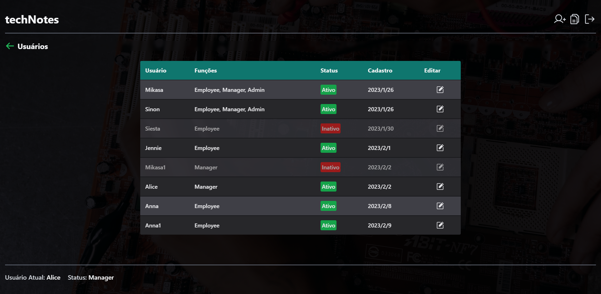

  <strong>techNotes</strong>

  

## 💻 Projeto

Aplicação para gerenciar notas e usuários.

## 🧪 Tecnologias

- [TypeScript](https://www.typescriptlang.org/)
- [React](https://reactjs.org/)
- [React Hook Form](https://react-hook-form.com/)
- [Radix](https://www.radix-ui.com/)
- [Redux Toolkit](https://redux-toolkit.js.org/)
- [Tailwind CSS](https://tailwindcss.com/)

## 📝 Licença

Esse projeto está sob a licença MIT. Veja o arquivo [LICENSE](LICENSE) para mais detalhes.

---

  Feito com ❤️ por Jh

